# Kusto Graph Assistant

[](https://github.com/cosh/KustoGraphAssistant/actions/workflows/build.yml)

A Model Context Protocol (MCP) server that provides comprehensive guidance and best practices for creating and managing Kusto graph models. This tool integrates seamlessly with GitHub Copilot in Visual Studio Code to assist developers in building effective graph-based analytics solutions using Azure Data Explorer (Kusto).

## What is KustoGraphAssistant?

Kusto Graph Assistant is an intelligent assistant that helps you:

- **Design effective graph schemas** - Get guidance on structuring nodes, edges, and relationships based on your data patterns
- **Optimize graph performance** - Learn best practices for query optimization and efficient graph model design
- **Simplify complex schemas** - Understand when and how to use property bags, dedicated columns, and schema evolution
- **Master graph-match queries** - Get comprehensive guidance on using the graph-match operator with persistent graphs
- **Follow KQL best practices** - Learn proper syntax, patterns, and performance optimization techniques

## Features

The MCP server provides several specialized tools:

### 🎯 GetGraphModelBestPractices

Comprehensive best practices covering:

- Core design principles for graph models
- Schema design guidelines and simplification strategies
- Performance optimization techniques
- Common patterns for identity graphs, network topology, and process flows

### 📋 GetGraphCommandGuidance

Detailed guidance on KQL commands including:

- Graph model creation and management syntax
- Query patterns for graph-match operations
- Performance tips and debugging strategies
- Common mistakes and how to avoid them

### 🔧 GetSchemaSimplificationGuidance

Specialized guidance on:

- Using property bags to reduce schema complexity
- ID type consistency (always use strings!)
- When to use dedicated properties vs. property bags
- Schema evolution strategies

### 🔍 GetGraphMatchGuidance

Complete reference for graph-match operator:

- Pattern notation and syntax
- Label checking with WHERE clauses
- Variable-length edge patterns
- Performance optimization techniques

## Prerequisites

- .NET 9.0 or later
- Visual Studio Code
- GitHub Copilot extension for VS Code

## Installation and Setup

### 1. Clone and Build the Project

```bash
git clone https://github.com/cosh/KustoGraphAssistant.git
cd KustoGraphAssistant
dotnet build
```

### 2. Configure the MCP Server in Visual Studio Code

Configure GitHub Copilot for Visual Studio Code to use your custom MCP server:

1. If you haven't already, open your project folder in Visual Studio Code.
2. Create a `.vscode` folder at the root of your project.
3. Add an `mcp.json` file in the `.vscode` folder with the following content:

   ```json
   {
     "inputs": [],
     "servers": {
       "KustoGraphAssistant": {
         "type": "stdio",
         "command": "dotnet",
         "args": [
           "run",
           "--project",
           "${workspaceFolder}/KustoGraphAssistant.csproj"
         ]
       }
     }
   }
   ```

4. Save the file.

### 3. Test the MCP Server

1. Open GitHub Copilot in Visual Studio Code and switch to agent mode.
2. Select the **Select tools** icon to verify your **KustoGraphAssistant** is available with all tools listed.

## Usage Examples

Once configured, you can interact with the assistant through GitHub Copilot:

### Getting Started with Graph Models

```text
What are the best practices for designing a graph model for user relationships?
```

### Schema Design Help

```text
How should I structure my graph schema for network topology analysis?
```

### Query Optimization

```text
Show me how to write efficient graph-match queries for finding shortest paths.
```

### Troubleshooting

```text
I'm getting errors with my graph model definition. What are common mistakes to avoid?
```

## Key Design Principles

This assistant emphasizes several important principles:

### 🔤 Always Use String IDs

- Convert all node and edge IDs to string type using `tostring()`
- Prevents type mismatch errors and ensures consistency

### 📦 Leverage Property Bags

- Use `pack_all()` to automatically capture all properties
- Create dedicated typed properties only for frequently filtered fields
- Schema definition is optional - start simple!

### ⚡ Optimize for Performance

- Apply filters early in Definition queries
- Use specific labels in graph-match WHERE clauses
- Limit variable-length path searches appropriately

### 🎯 Query Pattern Awareness

- Design your graph schema based on your query patterns, not just data structure
- Use graph-match for pattern matching, graph-shortest-paths for optimal paths
- Always include a project clause in graph-match queries

## Contributing

Contributions are welcome! Please feel free to submit issues, feature requests, or pull requests.

## License

This project is licensed under the MIT License - see the [LICENSE](LICENSE) file for details.

## 🔄 Data Flow & Integration

```mermaid
sequenceDiagram
    participant User as 👤 Developer
    participant VSCode as 📝 VS Code
    participant Copilot as 🤖 GitHub Copilot
    participant MCP as 🔌 MCP Server
    participant Tools as 🛠️ Graph Tools
    participant ADX as ☁️ Azure Data Explorer

    User->>VSCode: Opens project
    VSCode->>Copilot: Activates assistant
    Copilot->>MCP: Connects via stdio
    MCP->>Tools: Registers tool methods

    User->>Copilot: Asks about graph models
    Copilot->>MCP: Calls appropriate tool
    MCP->>Tools: Executes tool method
    Tools-->>MCP: Returns guidance/examples
    MCP-->>Copilot: JSON response
    Copilot-->>User: Formatted guidance

    User->>Copilot: Requests KQL examples
    Copilot->>MCP: GetGraphCommandGuidance()
    MCP->>Tools: Generates KQL templates
    Tools-->>User: Ready-to-use KQL code

    User->>ADX: Implements suggestions
    ADX-->>User: Creates graph models
```



## 🧩 Tool Ecosystem

```mermaid
mindmap
  root((🔗 Kusto Graph Assistant))
    🎯 Best Practices
      Core Principles
      Schema Design
      Performance
      Common Patterns
      Identity Graphs
      Network Topology
      Process Flows
    📋 Command Guidance
      Creation Commands
      Query Patterns
      Management
      Performance Tips
      Common Mistakes
      Debugging
    🔧 Schema Simplification
      Property Bags
      ID Consistency
      Dedicated Properties
      Evolution Strategy
      Query Patterns
    🔍 Graph Match
      Basic Syntax
      Pattern Notation
      Label Checking
      Variable Length
      WHERE Clause
      PROJECT Clause
      Examples
      Performance
```



## 🏗️ Technical Architecture

### Architecture Highlights

- **Model Context Protocol (MCP) server** - Standardized interface for tool integration
- **.NET 9.0 console application** - Modern, high-performance runtime
- **Dependency injection** with Microsoft.Extensions.Hosting for clean architecture
- **Stdio transport** for seamless VS Code integration
- **Assembly scanning** for automatic tool discovery and registration

### Core Tools

- **GetGraphModelBestPractices** - Comprehensive design guidance covering core principles, schema design, performance optimization, and common patterns for identity graphs, network topology, and process flows
- **GetGraphCommandGuidance** - KQL command templates for graph model creation, query patterns, management operations, and debugging strategies
- **GetSchemaSimplificationGuidance** - Schema optimization guidance including property bags, ID consistency, dedicated properties, and evolution strategies
- **GetGraphMatchGuidance** - Query pattern examples covering basic syntax, pattern notation, label checking, variable length paths, and performance optimization

### Integration Points

- **GitHub Copilot in VS Code** - Natural language interface for accessing graph modeling guidance
- **Azure Data Explorer (Kusto)** - Target platform for graph model implementation
- **Graph models and snapshots** - Persistent and transient graph storage mechanisms
- **KQL (Kusto Query Language)** - Query language for graph operations and analysis
- **JSON-based tool responses** - Structured data format for tool communication

### Key Features

- **Real-time guidance** for graph modeling decisions and best practices
- **Performance optimization recommendations** based on query patterns and data volume
- **Schema evolution strategies** for maintaining and updating graph models over time
- **Ready-to-use KQL templates** for common graph operations and patterns
- **Best practice enforcement** to prevent common mistakes and anti-patterns

## Support

If you encounter any issues or have questions:

1. Check the common patterns and troubleshooting guidance provided by the assistant
2. Review the KQL documentation for Azure Data Explorer
3. Submit an issue in this repository

---

**Happy Graph Modeling!** 🚀
